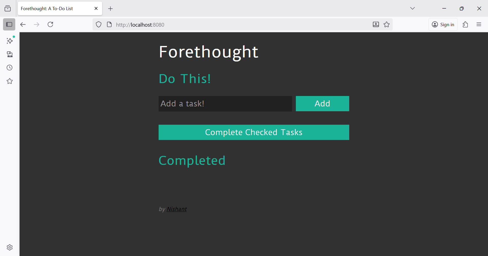
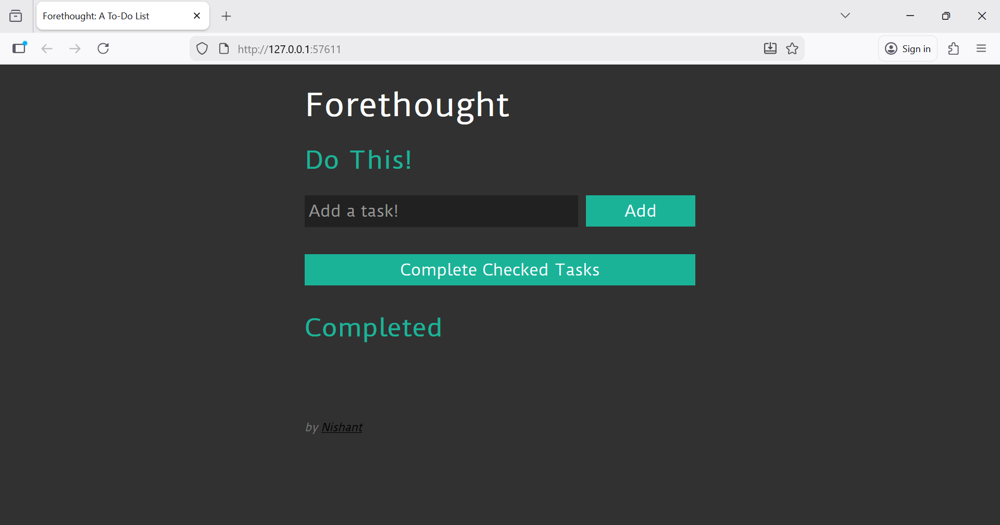

# Node.js Application Deployment using Docker and Kubernetes (Minikube)

This project demonstrates how to containerize and deploy a Node.js application using **Docker** and **Kubernetes (Minikube)**.

---
  
**Tools Used:**  
- **Docker** – For containerization   
- **Kubernetes (Minikube)** – An orchestration platform  

---

## Docker Setup

Step 1: Deployment of Node.js Application in Local System using Docker
1.1:

Created Dockerfile for Node.js application in the project directory.

1.2:

Build the Docker image using the command: $docker build -t forethought .

1.3:

Run the Docker image to get a running container: $docker run -d -p 8080:8080 --name forethought-cont forethought:latest

1.4:

Check whether the container is running using the command: $docker ps

Output:
http://localhost:8080

### Step 2: Deployment of Nodejs application using Minikube
2.1: 

Start Minikube cluster with adjusted memory
        $minikube start --driver=docker --cpus=2 --memory=2500

2.2: 

Check for the minikube status whether cluster is running
        
        $minikube status
        output:
        minikube
        type: Control Plane
        host: Running
        kubelet: Running
        apiserver: Running
        kubeconfig: Configured

2.3:  

To avoid image pull error/ build images directly inside Minikube’s Docker daemon  
        
        $& minikube -p minikube docker-env | Invoke-Expression

2.4: 

Build the docker image of nodejs application

2.5: 

Check whether image is created using the command
        
        $docker images
        REPOSITORY                                TAG       IMAGE ID       CREATED         SIZE
        forethought                               latest    3a388bc947ee   8 seconds ago   133MB
        registry.k8s.io/kube-apiserver            v1.27.4   e7972205b661   2 years ago     121MB
        registry.k8s.io/kube-proxy                v1.27.4   6848d7eda034   2 years ago     71.1MB
        registry.k8s.io/kube-controller-manager   v1.27.4   f466468864b7   2 years ago     113MB
        registry.k8s.io/kube-scheduler            v1.27.4   98ef2570f3cd   2 years ago     58.4MB
        registry.k8s.io/coredns/coredns           v1.10.1   ead0a4a53df8   2 years ago     53.6MB
        registry.k8s.io/etcd                      3.5.7-0   86b6af7dd652   2 years ago     296MB
        registry.k8s.io/pause                     3.9       e6f181688397   3 years ago     744kB
        gcr.io/k8s-minikube/storage-provisioner   v5        6e38f40d628d   4 years ago     31.5MB

2.6: 

Create a directory named k8s inside project root structure and include deployment.yaml and service.yaml
2.7: 

In deployment.yaml -> pods will be created with the image created and it maintains number of replicas

2.8: 

In service.yaml ->  network access to the Pods running. 

2.9: 

Check whether Pods and service in running state using commands,
        
        $kubectl get pods
        $kubectl get service
2.10: 

Forward the port, and Open default browser to access Node.js app running inside Minikube
        
        $minikube service dockerproj2-service
        |-----------|---------------------|-------------|---------------------------|
        | NAMESPACE |        NAME         | TARGET PORT |            URL            |
        |-----------|---------------------|-------------|---------------------------|
        | default   | dockerproj2-service |        8080 | http://192.168.49.2:30080 |
        |-----------|---------------------|-------------|---------------------------|
        🏃  Starting tunnel for service dockerproj2-service.
        |-----------|---------------------|-------------|------------------------|
        | NAMESPACE |        NAME         | TARGET PORT |          URL           |
        |-----------|---------------------|-------------|------------------------|
        | default   | dockerproj2-service |             | http://127.0.0.1:57611 |
        |-----------|---------------------|-------------|------------------------|

2.11: Output
